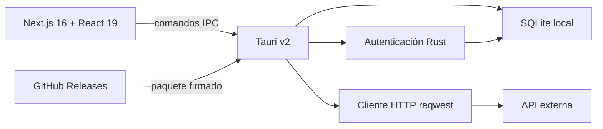

# Flux

Flux es una aplicación de escritorio para diseñar, guardar y ejecutar peticiones HTTP. Su objetivo es ofrecer un flujo similar a Postman, pero con una interfaz más enfocada, datos locales y un backend nativo construido con Rust y Tauri.

La aplicación organiza el trabajo en **workspaces**, cada workspace contiene sus propias **peticiones** y **environments**, y cada environment define variables reutilizables como `{{BASE_URL}}` o `{{TOKEN}}`.

> Estado actual: versión `1.0.0`, orientada principalmente a Windows x64.

## Contenido

- [Características](#características)
- [Cómo funciona el sistema](#cómo-funciona-el-sistema)
- [Arquitectura](#arquitectura)
- [Tecnologías](#tecnologías)
- [Requisitos de desarrollo](#requisitos-de-desarrollo)
- [Instalación y ejecución](#instalación-y-ejecución)
- [Estructura del proyecto](#estructura-del-proyecto)
- [Scripts disponibles](#scripts-disponibles)
- [Actualizaciones](#actualizaciones)
- [Seguridad y almacenamiento](#seguridad-y-almacenamiento)

## Características

### Aplicación de escritorio

- Ventana nativa administrada por Tauri v2.
- Iconos propios para Windows, macOS, iOS y Android.
- Interfaz adaptable a ventanas de distintos tamaños.
- Primera pantalla de bienvenida mostrada solamente en el primer inicio.
- Navegación diferente para usuarios autenticados y no autenticados.
- Visualización discreta de la versión instalada.

### Autenticación local

- Registro local con nombre, correo y contraseña.
- Inicio y cierre de sesión persistentes.
- Contraseñas almacenadas como hashes Argon2; nunca se guarda la contraseña original.
- Validación de correo, longitud del nombre y contraseña mínima de ocho caracteres.
- Toda la autenticación funciona sin un servidor externo.

La sesión activa se conserva mediante `tauri-plugin-store`. Los usuarios y hashes se guardan en SQLite.

### Workspaces

Un workspace representa un proyecto o contexto de trabajo independiente.

- Crear workspaces.
- Cambiar entre workspaces desde el navbar.
- Renombrar un workspace.
- Eliminarlo mediante un modal de confirmación.
- Separación completa de peticiones, environments y variables por workspace.
- Eliminación en cascada de todos los recursos asociados.

### Environments y variables

Cada workspace puede tener varios environments, por ejemplo `Local`, `Staging` o `Production`.

- Crear, seleccionar, renombrar y eliminar environments.
- Asignar un color identificativo.
- Pantalla dedicada para gestionar variables.
- Variables en formato clave/valor.
- Claves normalizadas a mayúsculas, por ejemplo `BASE_URL`.
- Autocompletado al escribir variables en URL, params, headers, autenticación o body.
- Resaltado visual de expresiones como `{{BASE_URL}}`.
- Notificaciones al crear, actualizar o eliminar variables.
- Confirmación antes de eliminar un environment o una variable.

Ejemplo:

```text
BASE_URL = https://api.example.com
TOKEN    = eyJhbGciOi...
```

Estas variables pueden utilizarse así:

```text
{{BASE_URL}}/v1/users
Authorization: Bearer {{TOKEN}}
```

Flux sustituye los valores del environment activo justo antes de enviar la petición.

### Gestión de peticiones

- Crear peticiones dentro del workspace activo.
- Guardar un nombre único por workspace.
- Renombrar, duplicar y eliminar peticiones.
- Menú contextual de acciones mediante los tres puntos verticales.
- El menú se cierra automáticamente al hacer clic fuera.
- La duplicación genera nombres como `Mi petición copia`, `Mi petición copia 2`, etc.
- La URL de una petición nueva comienza vacía.
- Sidebar limitado a las peticiones del workspace seleccionado.

Métodos HTTP disponibles:

| Método    | Uso habitual                       |
| --------- | ---------------------------------- |
| `GET`     | Consultar recursos                 |
| `POST`    | Crear o ejecutar acciones          |
| `PUT`     | Reemplazar recursos                |
| `PATCH`   | Actualizar parcialmente            |
| `DELETE`  | Eliminar recursos                  |
| `HEAD`    | Consultar solamente headers        |
| `OPTIONS` | Consultar capacidades del endpoint |

Cada verbo tiene un color propio tanto en el selector como en el sidebar.

### Constructor HTTP

El editor de peticiones permite configurar:

- URL con variables de environment.
- Query params habilitables individualmente.
- Headers habilitables individualmente.
- Autenticación.
- Body.
- Persistencia completa de la configuración en SQLite.

Tipos de autenticación:

- Sin autenticación.
- Bearer token. Flux sincroniza automáticamente `Authorization: Bearer <token>`.
- Basic Auth.
- API Key con nombre y valor configurables.

Tipos de body:

- Sin body.
- JSON.
- Texto plano.
- `application/x-www-form-urlencoded`.

Al cambiar el tipo de body, Flux ajusta el `Content-Type` cuando corresponde.

### Ejecución de peticiones

Las peticiones no se ejecutan desde el navegador. El frontend entrega la configuración a Rust mediante un comando Tauri y Rust realiza la conexión usando `reqwest`.

El motor HTTP:

- Resuelve variables antes de enviar.
- Construye query params, headers, autenticación y body.
- Mide la duración de la petición.
- Devuelve status code, status text, headers, body y tamaño.
- Limita las respuestas a 10 MB para proteger la memoria de la aplicación.
- Informa errores de conexión, timeout y configuración inválida.

### Visor de respuestas

- Panel de respuesta integrado debajo o junto al editor, según el tamaño de ventana.
- Status HTTP con colores según la familia `2xx`, `3xx`, `4xx` o `5xx`.
- Tiempo de respuesta y tamaño recibido.
- Vista JSON estructurada y vista raw.
- Expandir o contraer objetos y arrays.
- Buscar por claves o valores.
- Copiar el JSON completo.
- Copiar una ruta, por ejemplo `$.data.user.id`.
- Copiar únicamente el valor de un atributo.
- Fallback de texto para respuestas que no sean JSON.

### Importación de cURL

El botón **Importar cURL** convierte un comando copiado en una petición editable.

Puede reconocer:

- Método HTTP.
- URL y query params.
- Headers.
- Bearer token y Basic Auth.
- Body JSON, texto o form-urlencoded.
- Continuaciones de línea de Bash (`\`), CMD (`^`) y PowerShell (acento grave).

La importación no ejecuta el comando cURL. Solamente interpreta el texto y rellena el constructor. Después se puede revisar y guardar la petición.

### Notificaciones y confirmaciones

- Toasts de éxito y error mediante Sonner.
- Confirmación para eliminar workspaces, environments, variables y peticiones.
- Estados de carga y botones deshabilitados durante operaciones sensibles.

### Actualizaciones automáticas

- Comprobación automática al iniciar Flux.
- Comprobación manual desde el engranaje de configuración.
- Modal con versión instalada, versión disponible y notas de release.
- Descarga con progreso.
- Posibilidad de instalar ahora o más tarde.
- Instalación pasiva en Windows y reinicio de Flux.
- Verificación criptográfica obligatoria antes de instalar.
- Publicación automatizada mediante GitHub Actions y GitHub Releases.

Consulta [docs/UPDATES.md](docs/UPDATES.md) para configurar la firma y publicar nuevas versiones.

## Cómo funciona el sistema



1. Next.js renderiza la interfaz y gestiona el estado de los formularios.
2. Los clientes TypeScript llaman comandos Tauri mediante IPC.
3. Rust valida que el usuario sea dueño del recurso solicitado.
4. SQLite conserva usuarios, workspaces, environments, variables y peticiones.
5. Para enviar una petición, Rust construye y ejecuta la llamada HTTP.
6. La respuesta vuelve al frontend para mostrarse como JSON o texto.

## Arquitectura

### Frontend

El frontend utiliza el App Router de Next.js y se exporta como contenido estático dentro del ejecutable Tauri.

- `app/`: layout global, estilos y entrada principal.
- `components/`: navegación y componentes UI reutilizables.
- `features/`: funcionalidades agrupadas por dominio.
- `lib/`: utilidades compartidas.

### Backend nativo

El backend está dentro de `src-tauri/src/`:

- `lib.rs`: inicialización de Tauri, plugins, comandos y migración del antiguo AppData.
- `database.rs`: conexión, configuración WAL y creación del esquema SQLite.
- `auth.rs`: registro, login, validación y Argon2.
- `workspace.rs`: CRUD de workspaces, environments y variables.
- `request.rs`: CRUD de peticiones y ejecución HTTP.

### Comunicación IPC

Los archivos cliente del frontend encapsulan las llamadas a Rust:

- `features/auth/auth-client.ts`
- `features/workspaces/workspace-client.ts`
- `features/requests/request-client.ts`

Esto evita que los componentes visuales conozcan detalles del comando Rust o del formato interno de SQLite.

## Tecnologías

| Área                     | Tecnología                      |
| ------------------------ | ------------------------------- |
| Desktop                  | Tauri v2                        |
| Backend                  | Rust                            |
| Cliente HTTP             | Reqwest + Rustls                |
| Base de datos            | SQLite mediante Rusqlite        |
| Seguridad de contraseñas | Argon2                          |
| Frontend                 | Next.js 16.2 + React 19         |
| Lenguaje frontend        | TypeScript                      |
| Estilos                  | Tailwind CSS 4                  |
| Editores                 | CodeMirror y Monaco             |
| Componentes              | Base UI, shadcn y Lucide        |
| Formularios              | React Hook Form + Zod           |
| Estado y consultas       | Zustand + TanStack Query        |
| Notificaciones           | Sonner                          |
| Actualizaciones          | Tauri Updater + GitHub Releases |

## Requisitos de desarrollo

Para Windows:

- Node.js 22 o una versión LTS compatible.
- npm.
- Rust estable mediante `rustup`.
- Visual Studio 2022 Build Tools con **Desktop development with C++**.
- Microsoft Edge WebView2 Runtime.
- Git.

Los requisitos nativos completos de Tauri están disponibles en la documentación oficial de Tauri.

## Instalación y ejecución

### 1. Instalar dependencias

```powershell
npm install
```

### 2. Ejecutar como aplicación Tauri

```powershell
npm run tauri dev
```

Este es el modo recomendado porque habilita SQLite, autenticación, ejecución HTTP, Store y demás plugins nativos.

### 3. Ejecutar solamente el frontend

```powershell
npm run dev
```

Después abre `http://localhost:3000`.

Este modo sirve para trabajar en la interfaz. Las operaciones que dependen de comandos Rust o plugins Tauri necesitan la aplicación de escritorio.

### 4. Compilar para producción

```powershell
npm run tauri build
```

Los artefactos se generan dentro de:

```text
src-tauri/target/release/bundle/
```

Cuando `createUpdaterArtifacts` está habilitado, la build de distribución necesita la clave privada del updater en una variable de entorno.

## Estructura del proyecto

```text
flux/
├── .github/workflows/
│   └── release.yml             # Publicación de releases para Windows
├── app/
│   ├── globals.css             # Tema y estilos globales
│   ├── layout.tsx              # Layout raíz, fuentes y notificaciones
│   └── page.tsx                # Entrada de la aplicación
├── components/
│   ├── app-shell/              # Navbar público
│   └── ui/                     # Componentes visuales reutilizables
├── docs/
│   └── UPDATES.md              # Manual de actualizaciones firmadas
├── features/
│   ├── auth/                   # Login, registro y sesión
│   ├── onboarding/             # Experiencia del primer inicio
│   ├── requests/               # Builder, cURL, respuestas y JSON tree
│   ├── updater/                # Interfaz del actualizador
│   └── workspaces/             # Shell autenticado y recursos del workspace
├── public/                     # Recursos del frontend
├── scripts/
│   └── set-version.mjs         # Sincronización de versiones
├── src-tauri/
│   ├── capabilities/           # Permisos IPC de Tauri
│   ├── icons/                  # Iconos por plataforma y resolución
│   ├── src/                    # Backend Rust
│   ├── Cargo.toml              # Dependencias Rust
│   └── tauri.conf.json         # Configuración desktop y updater
├── package.json
└── README.md
```

## Scripts disponibles

| Comando                            | Descripción                                  |
| ---------------------------------- | -------------------------------------------- |
| `npm run dev`                      | Inicia solamente Next.js en desarrollo       |
| `npm run build`                    | Genera y valida el frontend de producción    |
| `npm run start`                    | Sirve una build de Next.js                   |
| `npm run lint`                     | Ejecuta ESLint                               |
| `npm run tauri dev`                | Inicia la aplicación desktop en desarrollo   |
| `npm run tauri build`              | Compila los instaladores de producción       |
| `npm run release:version -- 0.2.0` | Sincroniza la versión en todos los manifests |

Validación recomendada antes de subir cambios:

```powershell
npm run lint
npm run build
cargo check --manifest-path src-tauri/Cargo.toml
```

## Actualizaciones

Flux consulta el siguiente canal estable:

```text
https://github.com/danielm-qva/flux/releases/latest/download/latest.json
```

Flujo resumido para publicar:

1. Configura `TAURI_SIGNING_PRIVATE_KEY` en los secrets del repositorio.
2. Incrementa la versión:

   ```powershell
   npm run release:version -- 0.2.0
   ```

3. Haz commit y push.
4. Ejecuta **Publish Flux for Windows** desde GitHub Actions.
5. Escribe las notas de la versión.
6. GitHub compila NSIS, firma el paquete, genera `latest.json` y publica la release.

La clave pública está incluida en `src-tauri/tauri.conf.json`. La clave privada debe mantenerse fuera del repositorio. Lee el procedimiento completo en [docs/UPDATES.md](docs/UPDATES.md).

## Seguridad y almacenamiento

### SQLite

La base se crea como `flux.sqlite3` dentro del directorio AppData asignado a `com.flux.desktop`.

- Modo WAL para mejorar concurrencia y recuperación.
- Foreign keys activadas.
- Timeout para evitar fallos inmediatos cuando la base está ocupada.
- Índices para usuarios, workspaces, environments, variables y peticiones.
- Migración automática de la base usada anteriormente por `com.tauri.dev`.

La base no forma parte del instalador, por lo que los datos sobreviven a una actualización de la aplicación.

### Consideraciones

- El login actual es completamente local; no sincroniza cuentas entre computadoras.
- Variables, tokens y configuración de requests se almacenan localmente. Actualmente no se cifran campo por campo.
- Las contraseñas sí se protegen con Argon2 y salt aleatorio.
- Los paquetes de actualización se validan mediante la firma de Tauri.
- Para distribución pública en Windows se recomienda añadir además firma Authenticode para reducir advertencias de SmartScreen.
- Los cambios futuros del esquema SQLite deben incluir migraciones compatibles con instalaciones existentes.
